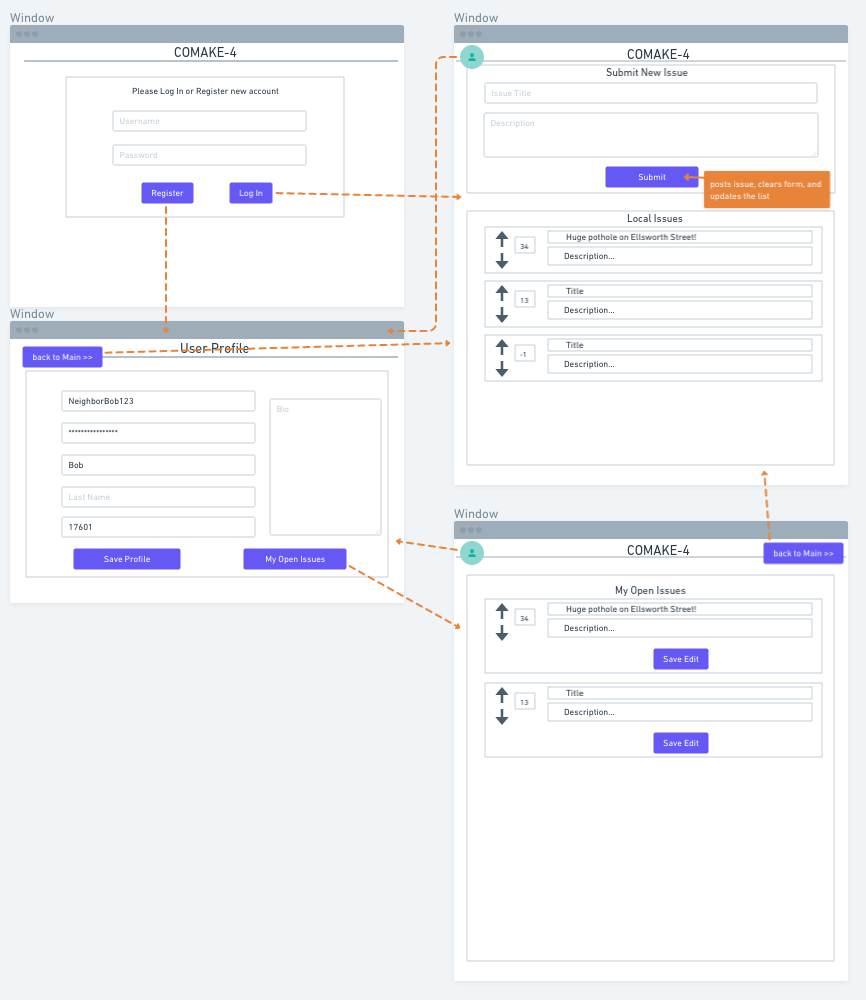

# COMAKE Refactored

## [Comake-Remake](https://bw-comake-4-frontend.phillybenh.now.sh)

In an effort to get my portfolio in order and keep the project updated, I'm refactoring this project to better match the original wireframe, improve readability and test coverage, and generally better align with my current preferences.

### Focus

- App Styling
  - Switch to Sass
  - Improve match with wireframe
- Readability and code style
- Test Coverage

### To Do

#### Ben's Components

| Component      | Update          | Completed? |
| :------------- | :-------------- | :--------: |
| Login/Register | Sass            |     ✅     |
|                | Styling         |     ✅     |
|                | Code Quality    |     ✅     |
|                | Test Coverage   |            |
|                | Form Validation |            |
| User Profile   | Sass            |     ✅     |
|                | Styling         |     ✅     |
|                | Code Quality    |     ✅     |
|                | Test Coverage   |            |
|                | Form Validation |            |
| My Issues      | Sass            |            |
|                | Styling         |            |
|                | Code Quality    |            |
|                | Test Coverage   |            |
| Edit Issues    | Sass            |            |
|                | Styling         |            |
|                | Code Quality    |            |
|                | Test Coverage   |            |
|                | Form Validation |            |

#### Emixo's Components

| Component        | Update              | Completed? |
| :--------------- | :------------------ | :--------: |
| Upvote           | Fix Infinite Upvote |            |
| Local Issues     | Sass                |            |
|                  | Styling             |            |
|                  | Code Quality        |            |
|                  | Test Coverage       |            |
| Submit New Issue | Sass                |            |
|                  | Styling             |            |
|                  | Code Quality        |            |
|                  | Test Coverage       |            |

## Original README

[Original Project Repo](https://github.com/bw-comake-4)

---

## frontend

React 1: [emixo](https://github.com/emixo)

React 2: [phillybenh](https://github.com/phillybenh)

[Comake 4!](http://bw-comake-4.now.sh)

[Product Vision Document](https://docs.google.com/document/d/19cj7ZuVeynSKy3n5PHvHS1GKXavlr_-4IpCCjDo3JE0/edit?usp=sharing)

[Wireframe](https://whimsical.com/QBYpHL4M3f3CWH7e8XK1Ek)

Co-Make Product Vision
☝️ Proposal

What problem does your app solve?
Helps the community
Be as specific as possible; how does your app solve the problem?
Helps report issues with your community and increases community engagement
Helps with prioritizing problems
What is the mission statement?
Empower citizens to help initiate the change they want to see in their community
💡 Features

What features are required for your minimum viable product?
Upvote / downvote
Submitting/editing issues
Creating a user profile
Login/Logout
Signup
Required pages
What features may you wish to put in a future release?
Comment sections
Analytics dashboard
What do the top 3 similar apps do for their users?
See Click Fix
Next door
Philly311
🛠 Frameworks - Libraries

What 3rd party frameworks/libraries are you considering using?
Styled components
Reactstrap
Boostrap
Do the APIs you need require you to contact them to gain access?
No
Are you required to pay to use said API(s)?
🎯 Target Audience

Who is your target audience? Be specific.
Concerned citizens
Neighbors
What feedback have you gotten from potential users?
Have you validated this problem and your solution with a target audience? Describe how,

🔑 Prototype Key Feature(s)

How long do you think it will take to implement these features?
Within a week
Do you anticipate working on stretch functionality after completion of a Minimal Viable Product?
TBD
